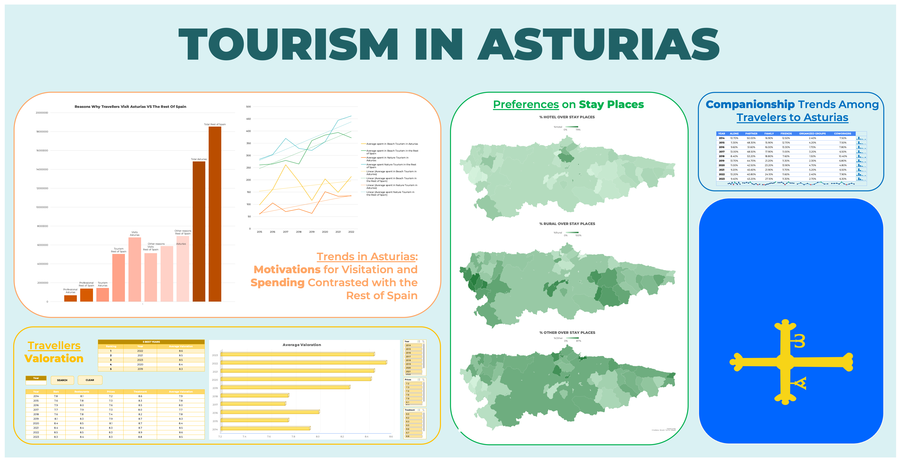

# 📊 Excel Project: Asturias Tourism Dashboard

## ✨ Summary

This project is a comprehensive **Microsoft Excel dashboard and analysis** of tourism trends in the Principality of Asturias, using public data from **[SADEI](https://www.sadei.es/sadei/informacion-estadistica/banco-de-datos_263_1_ap.html)**.  

We analyzed **over 50,000 data points** from multiple datasets, including:

- Hotels and restaurants by council  
- Spending of national tourists  
- Travel motivations  
- Index prices of hotels  
- Traveler types and valuations  

The analysis includes comparisons with the rest of Spain to provide a competitive benchmark. The final dashboard is dynamic, multi-sheet, and highlights advanced Excel capabilities such as Pivot Tables, dynamic charts, and interactive macros.

Here is a screenshot of the dashboard (the Excel file itself is fully interactive):

---

## 📈 Key Achievements

- **Data Management & Analysis:** Organized and cleaned large datasets, managed cell operations, and created structured tables for efficient analysis.  
- **Advanced Excel Formulas:** Used logical, lookup, statistical, and arithmetic functions for complex calculations and insights.  
- **Pivot Tables & Dynamic Charts:** Built Pivot Tables and charts to summarize and visualize trends, one of the most in-demand Excel features.  
- **Interactive Dashboard Features:** Developed macros and buttons to enable smooth navigation, filtering, and user interaction within the dashboard.  
- **Insights Delivered:** Identified key tourism trends, including visitor motivations, spending patterns, accommodation preferences, companionship types, and overall traveler valuations.  

---

## 🛠️ Excel Capabilities Highlighted

- **Advanced Analysis with Pivot Tables & Dynamic Charts:** Built complex Pivot Tables to summarize large datasets (30,000+ data points) and create dynamic charts for actionable insights — one of the most highly demanded Excel skills.  
- **Interactive Dashboard Features:** Developed VBA macros and buttons to automate navigation, filtering, and interactivity within the dashboard, enhancing usability for end-users.  
- **Data Organization & Formatting:** Applied structured tables, custom fonts, conditional formatting, and cell styling to ensure a professional, readable dashboard.  
- **Formulas & Calculations:** Utilized logical (`IF()`), lookup (`XLOOKUP()`, `VLOOKUP()`), text (`UPPER()`, `SEARCH()`), statistical (`COUNTIF()`, `LARGE()`), and arithmetic operations to process and analyze data efficiently.  
- **Sparklines & Mini Charts:** Embedded sparklines for quick, at-a-glance trend visualization directly within tables.

---

## 📚 Data Source

Data obtained from **[SADEI – Banco de Datos Estadísticos](https://www.sadei.es/sadei/informacion-estadistica/banco-de-datos_263_1_ap.html)**.

---

## 👥 Authors

* **Carla Aranda Sánchez**
* **Mateo Uruñuela Martínez**
* **Jiawei Xu**
